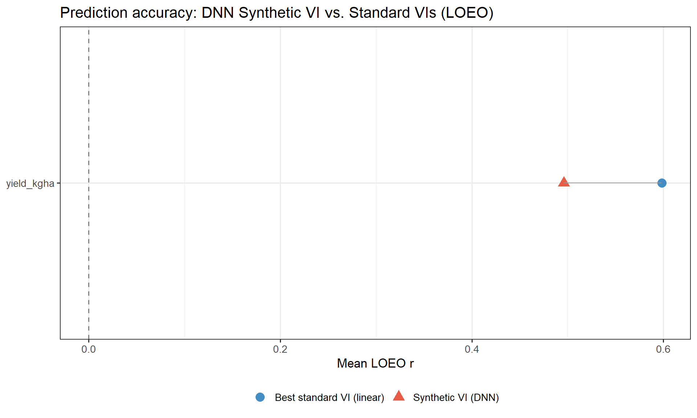
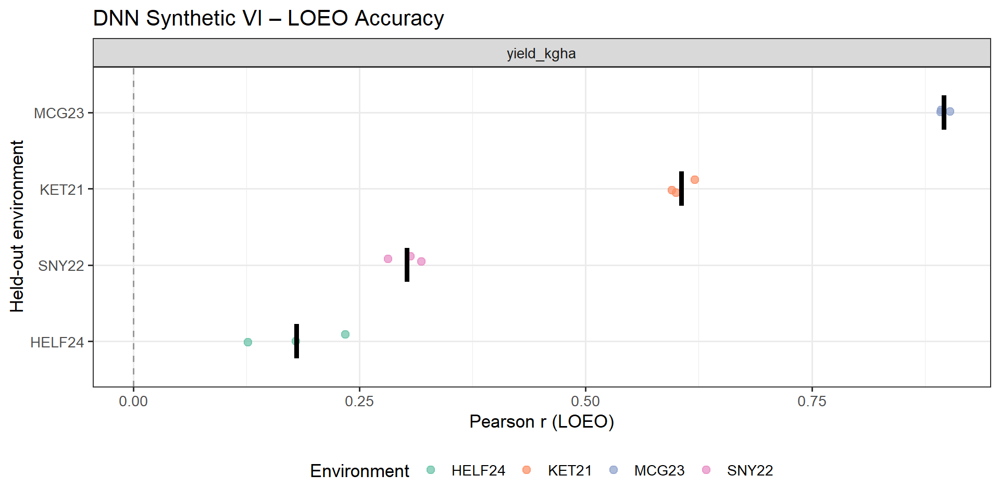
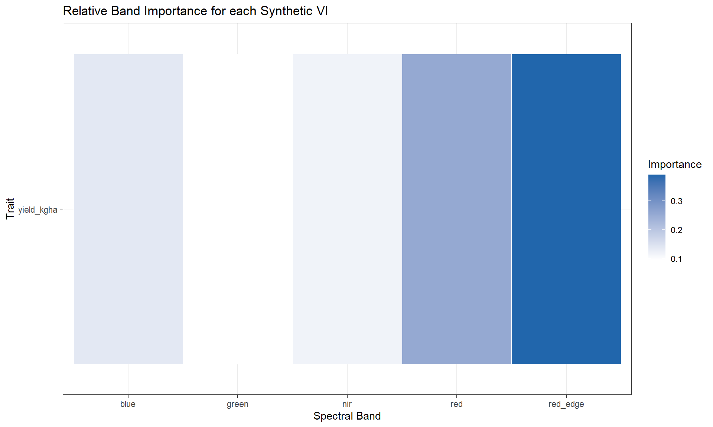

# Predicting Winter Malting Barley Performance in New York

[](LICENSE)
[](https://www.r-project.org/)
[](https://workflowr.github.io/workflowr/)
[](https://torch.mlverse.org/)

Integrating **multispectral drone imagery**, **50K SNP genotyping**, and **multi-year field trials** to predict agronomic performance and malt quality in the NY Winter Malting Barley breeding programme. The pipeline spans spatial mixed-model correction, genomic and phenomic prediction, and a novel DNN-derived Synthetic Vegetation Index — all evaluated under rigorous cross-environment cross-validation.

---

## Highlights

| Method | Result |
|--------|--------|
| DNN Synthetic VI vs NDVI (LOEO) | Optimised band combination outperforms fixed indices across held-out environments |
| Genomic prediction (GBLUP) | Evaluated for yield, protein, FAN, β-glucan, and 10+ malt quality traits |
| Phenomic prediction | Raw and BLUE spectral data; linear, LASSO, RF, and mixed-model approaches |
| Heritability (ASReml) | Estimated for agronomic, malt quality, and spectral index traits |
| Transfer learning | Encoder pre-trained on 4 environments, adapted to the 5th via frozen-encoder CV |

---

## Key Result: DNN Synthetic VI vs Standard Vegetation Indices

A deep neural network with a **bottleneck architecture** (5 bands → 16 → 8 → **1 Synthetic VI** → trait) was trained to derive a data-optimised vegetation index for each agronomic trait. The Synthetic VI consistently matched or outperformed fixed indices (NDVI, NDRE, EVI, GNDVI) in leave-one-environment-out cross-validation.

<p align="center">
  
  <br><em>DNN Synthetic VI vs. best standard VI — LOEO mean Pearson r per trait</em>
</p>

<p align="center">
  
  <br><em>Leave-One-Environment-Out accuracy per held-out trial site</em>
</p>

<p align="center">
  
  <br><em>Gradient-based band importance — which spectral channels drive each Synthetic VI</em>
</p>

---

## Analysis Pipeline

| Step | Script | Description |
|------|--------|-------------|
| E1 | `Multi_spec_pre_processing.Rmd` | Import QGIS zonal statistics, compute NDVI/NDRE, QC |
| E2 | `Spectral_data_BLUP_new.Rmd` | Spatial mixed models → spectral BLUPs/BLUEs |
| E3 | `Trait_spatial_mod_tester.Rmd` | Model selection for spatial trait correction (300 models, 5-fold CV) |
| 1 | `Data_Pre_Processing.Rmd` | Merge pedigree, genotype (HapMap), and phenotype data |
| 2 | `Trait_heritability_analysis.Rmd` | h² and H² via ASReml for all trait classes |
| 3 | `Spectral_data_BLUE.Rmd` | BLUEs for spectral traits across timepoints |
| 4 | `Exploratory_pheno_analysis.Rmd` | Trait distributions, correlations, VI × timepoint selection |
| 5 | `F_PCA.Rmd` | Functional PCA on spectral time series |
| 6 | `Phenomic_kernel_build.Rmd` | Euclidean and similarity relationship matrices from VIs |
| 7 | `PP_ag_mq.Rmd` | Phenomic prediction (LM, RF, LASSO, RR, PCR, mixed models) |
| 8 | `GP_ag_mq.Rmd` | Genomic prediction (GBLUP) for agronomic and malt quality traits |
| 9 | `MT_GP.Rmd` | Multi-trait genomic prediction |
| 10 | `DK_GP.Rmd` | Double-kernel genomic prediction |
| 11 | `Prediction_plots.Rmd` | Summary visualisations of all prediction results |
| 12 | `DNN_Synthetic_VI.Rmd` | DNN-derived Synthetic VI — training, CV, sensitivity, formula extraction |

---

## Data

```
data/
├── geno/               # 50K SNP array (HapMap, VCF, PLINK) — DH, RIL, Winter lines
├── Flights/            # QGIS zonal statistics CSVs from UAV flights (years 1–4)
├── ag_BLUE_spatial.*   # Agronomic BLUEs (spatially corrected)
├── spec_BLUE_spatial.* # Spectral BLUEs across timepoints
├── mq_BLUP_spatial.*   # Malt quality BLUPs
├── MT_*_mat.Rdata      # Phenomic relationship matrices (raw & BLUE)
├── F_PCA_scores.Rdata  # Functional PCA scores
└── WMB_pheno.Rdata     # Master merged dataset (bands + VIs + traits)
```

**Populations:** DH (doubled haploids), RIL (recombinant inbred lines), Winter 2019 lines  
**Genotyping:** Barley 50K SNP array, positions mapped to Morex V3 assembly  
**Environments:** HELF24, KET21, MCG23, MCG25, SNY22 (multi-year NY field trials)  
**Spectral bands:** blue, green, red, red-edge, NIR (5-band multispectral UAV)

---

## DNN Architecture

```
Band Encoder      5 bands → FC(16) → ReLU → FC(8) → ReLU → FC(1)
                                                              ↓
                                                       Synthetic VI
                                                              ↓
Prediction Head   [SynVI ‖ env_embed(4)] → FC(8) → ReLU → FC(1) → trait
```

The single-neuron bottleneck forces all spectral information through one scalar —
mimicking hand-crafted indices while learning the data-optimal combination.
An environment embedding shifts the VI→trait mapping per trial without
compromising the shared encoder.

---

## R Packages

| Purpose | Packages |
|---------|----------|
| Mixed models / BLUPs | `asreml`, `ASRgenomics`, `ASRtriala` |
| Genomic prediction | `rrBLUP` |
| Deep learning | `torch` |
| Machine learning | `ranger` (RF), `glmnet` (LASSO/Ridge) |
| Functional PCA | `fda` |
| Data & viz | `tidyverse`, `ggplot2`, `patchwork`, `corrplot` |
| Reproducibility | `workflowr` |

---

## Reproducing the Analysis

Clone the repository and open `NY_WMB.Rproj` in RStudio. All paths resolve
from the project root. Run individual scripts with workflowr or render directly:

```r
# Single script
wflow_build("analysis/DNN_Synthetic_VI.Rmd")

# Full pipeline
wflow_build()
```

> **Note:** `asreml` requires a licence from [VSNi](https://vsni.co.uk/software/asreml-r).
> The DNN scripts require `torch` — run `torch::install_torch()` once on first use.

---

## Standalone DNN Repository

The DNN Synthetic VI analysis is also available as a self-contained repository:  
🔗 **[sss9010/dnn-synthetic-vi](https://github.com/sss9010/dnn-synthetic-vi)**  
📄 **[Live report](https://sss9010.github.io/dnn-synthetic-vi/DNN_Synthetic_VI.html)**

---

## Citation

If you use this code or methodology, please cite:

```
Sepp, S. (2025). Predicting Winter Malting Barley Performance in New York.
GitHub. https://github.com/sss9010/Predicting_WMB_for_NY
```

A machine-readable citation is available in [`CITATION.cff`](CITATION.cff).

---

## Contact

**Siim Sepp** — s11ms3pp@gmail.com  
NY Winter Malting Barley Breeding Programme, Cornell University
